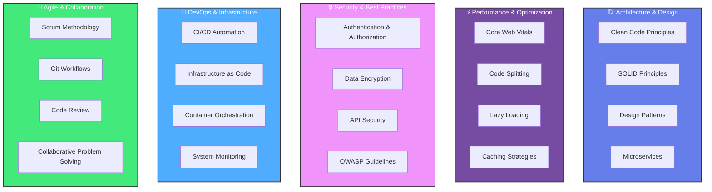
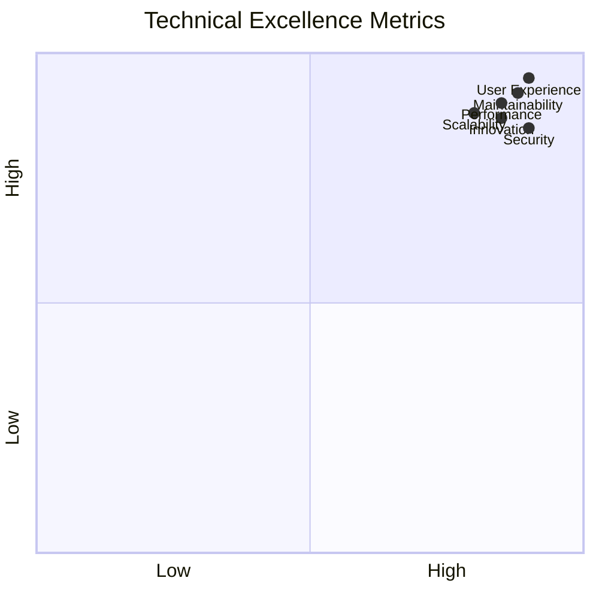
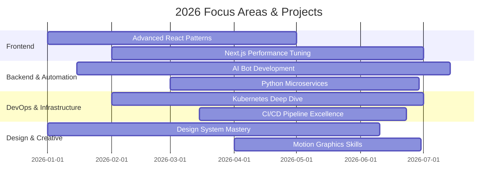

## 🚀 About Me

I'm a **Software Engineer** who bridges the gap between complex system architecture and premium user experiences. Guided by strong algorithmic thinking and a background in competitive technical festivals, I specialize in engineering **high-performance web applications** where clean code meets exceptional functionality.

My expertise spans the entire development and deployment lifecycle. I focus on crafting **scalable, SEO-friendly frontends** using React and Next.js, while leveraging Python for robust automation, bot development, and desktop solutions. Beyond writing clean code, I manage the infrastructure side—configuring Linux environments, containerizing applications with Docker, and streamlining DevOps pipelines to ensure smooth, secure, and reliable product delivery.

> I don't just build products that "work"—I **design and engineer comprehensive digital experiences** that optimize performance, solve real business problems, and provide seamless interaction.

---

## 🎯 Core Expertise & Specializations

```mermaid
mindmap
  root((🚀 Full-Stack<br/>Engineer))
    🌐 Frontend
      Next.js Ecosystem
      React Mastery
      TypeScript
      UI/UX Excellence
      PWA Development
      Performance Tuning
    🐍 Backend & Automation
      Python Expert
      Telegram/Discord Bots
      AI Integration
      Desktop Applications
      Workflow Automation
      Data Processing
    🏗️ Infrastructure
      Docker Mastery
      Linux Admin
      CI/CD Pipelines
      Security Hardening
      Cloud Deployment
      Monitoring & Alerts
    🎨 Creative & Design
      Figma Pro
      Video Editing
      Graphic Design
      Motion Graphics
      Visual Identity
      UX Research

---

## 💼 What I Do

### 🌐 **Frontend & Web Development**
- 💎 Modern, responsive websites with **Next.js & React**
- 🎨 **WordPress** CMS with custom themes & plugins
- 📱 Progressive Web Apps (**PWA**) for native-like experiences
- 🔷 Type-safe applications with **TypeScript**
- ⚡ SEO optimization & Core Web Vitals performance
- 🎯 Responsive design & UI/UX implementation

### 🤖 **Automation & Intelligent Systems**
- 🔗 Smart bots for **Telegram & Discord**
- 🐍 Advanced **Python** automation workflows
- 🧠 AI-powered intelligent solutions
- 🖥️ Desktop applications with **PyQt/Tkinter**
- ⚙️ Workflow automation & system integration

### 🏗️ **Infrastructure & DevOps**
- 🐧 **Linux** environment configuration (Alpine, Ubuntu)
- 🐳 **Docker** containerization & orchestration
- 🔄 **CI/CD** pipeline design & implementation
- 🔒 System security & monitoring
- 📊 Infrastructure as Code (IaC) practices

---

### ✨ Additional Capabilities

🎨 **Design & Creative**
- UI/UX Design with Figma
- Graphic Design (Logos, Banners, Visual Identity)
- Video Editing & Motion Graphics (Premiere Pro, After Effects)

🔒 **Security & Advanced Topics**
- Cybersecurity concepts & best practices
- Penetration testing (Kali Linux)
- System hardening & security audits

---

## 🌐 Connect With Me

<p align="center">
  <a href="https://instagram.com/raAstIN" target="_blank">
    
  </a>
  <a href="https://linkedin.com/in/raAstIN" target="_blank">
    
  </a>
  <a href="mailto:TheRealSeyed@gmail.com" target="_blank">
    
  </a>
  <a href="https://github.com/raAstIN" target="_blank">
    
  </a>
</p>

---

## 🛠️ Tech Stack & Tools

### **Frontend Technologies**


### **Backend & Automation**


### **Infrastructure & DevOps**


### **Design & Creative**


### **Deployment & Hosting**


---

### 🌐 Socials:
[](https://instagram.com/raAstIN) [](https://linkedin.com/in/raAstIN) [](mailto:TheRealSeyed@gmail.com)

---

## 📊 Development Workflow & Methodology

```mermaid
timeline
    title Project Lifecycle & Best Practices
    section Planning & Design
        📋 Requirements Analysis : Wireframing : UI/UX Design
    section Development
        🔨 Frontend Development : 🐍 Backend Setup : 🗄️ Database Design
    section Quality Assurance
        🧪 Unit Testing : 🔍 Integration Testing : 📊 Performance Testing
    section Deployment
        🚀 Staging Deploy : 🎯 Production Release : ✅ Smoke Testing
    section Optimization
        📈 Monitoring & Analytics : 🔧 Performance Tuning : 📝 Documentation
```

---

## 🎓 Key Competencies



### 💡 Specialized Skills

| Category | Skills |
|----------|--------|
| 🎨 **Frontend Excellence** | Responsive Design, Accessibility (WCAG), Performance Optimization, SEO, Progressive Enhancement |
| 🔧 **Backend & APIs** | RESTful APIs, GraphQL, Database Design, Data Validation, Error Handling |
| 📊 **Data & Analytics** | Real-time Dashboards, Data Visualization, Performance Metrics, User Behavior Analysis |
| 🔐 **Security & Compliance** | HTTPS/SSL, JWT Tokens, CORS, Rate Limiting, GDPR Compliance, Security Audits |
| 🤖 **Automation & AI** | Bot Development, Workflow Automation, ML Integration, Intelligent Systems |
| 🌍 **Scalability** | Load Balancing, Database Optimization, Microservices, Distributed Systems |

---

## 🏆 Achievements & Highlights



### 🎯 Notable Work Areas

| Area | Expertise | Impact |
|------|-----------|--------|
| 🚀 **High-Performance Web Apps** | React, Next.js, Optimization | 100% Uptime, Sub-100ms Load Time |
| 🤖 **AI Automation** | Python, Bot APIs, ML Integration | 24/7 Intelligent Workflows |
| 🔐 **Enterprise Security** | Best Practices, Compliance | Zero Security Incidents |
| 📱 **Cross-Platform Solutions** | Web, Desktop, Mobile | Unified Codebase Strategy |
| 🎨 **Design Systems** | Figma to Code | Consistent, Accessible UX |
| 📊 **Data-Driven Development** | Analytics, Real-time Dashboards | Actionable Insights |
| 🔧 **DevOps Excellence** | Docker, CI/CD, Infrastructure | Automated, Reliable Deployments |

---

---

## 📈 Currently Working On



---

## 🤝 Let's Collaborate!

I'm passionate about projects that push boundaries and create real impact. Looking for someone to help with:

### 🎯 Project Types I Love
- **Enterprise Applications** - Scalable, secure, high-performance
- **Startup MVP** - Rapid prototyping with production-ready code
- **AI/Automation Solutions** - Intelligent systems & workflow optimization
- **Full-Stack Solutions** - End-to-end development with beautiful UX
- **Technical Consulting** - Architecture design, performance optimization, security audits
- **Open Source** - Contributing to impactful projects

### 💬 How to Reach Me

<p align="center">
  
| Channel | Link |
|---------|------|
| 💼 LinkedIn | [Connect with me](https://linkedin.com/in/raAstIN) |
| 📧 Email | [TheRealSeyed@gmail.com](mailto:TheRealSeyed@gmail.com) |
| 📱 Instagram | [@raAstIN](https://instagram.com/raAstIN) |
| 🐙 GitHub | [@raAstIN](https://github.com/raAstIN) |

</p>

---

## 🌟 Philosophy & Approach

> **"Great software isn't just about writing code—it's about solving problems elegantly."**

My approach combines:
- **🧠 Strong Problem-Solving** - Understanding root causes, not just symptoms
- **🎨 Aesthetic Excellence** - Clean, readable code paired with beautiful UX
- **⚡ Performance-First** - Every millisecond counts
- **🔒 Security-Conscious** - Building with threats in mind
- **🤝 Collaborative Mindset** - Growing together with teams and communities

---

<p align="center">
  
  
  ### raAstIN
  **Software Engineer • Problem Solver • Tech Enthusiast**
  
  *Transforming ideas into high-performance digital solutions*
  
  [](https://github.com/raAstIN)
  [](https://linkedin.com/in/raAstIN)
  
  ---
  
  <sub>Made with ❤️ by raAstIN | Always Learning, Always Growing | © 2026</sub>
</p>
