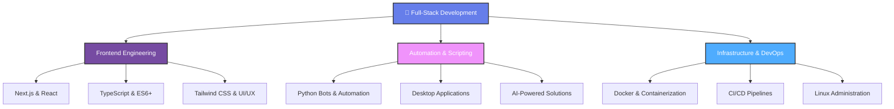
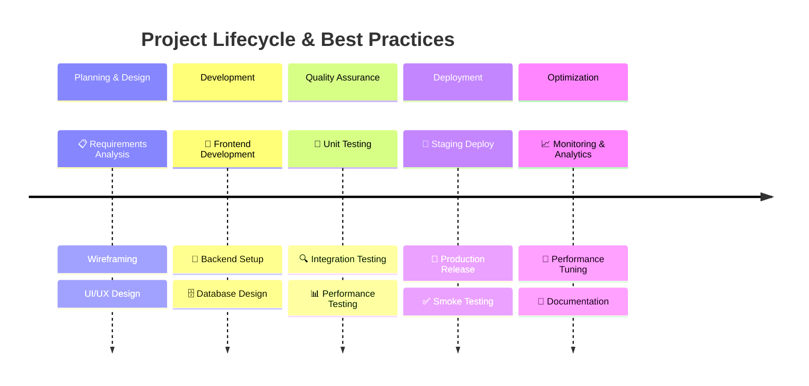
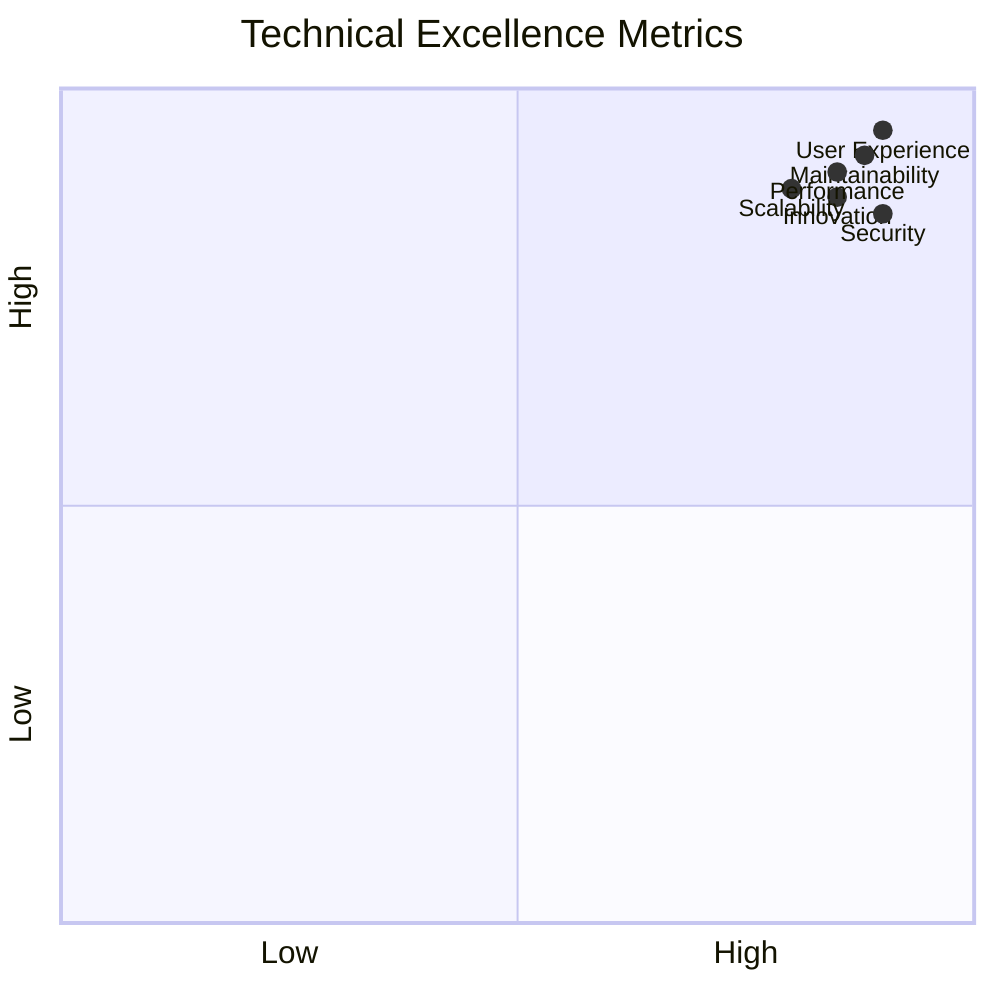

## 🚀 About Me

I'm a **Software Engineer** who bridges the gap between complex system architecture and premium user experiences. Guided by strong algorithmic thinking and a background in competitive technical festivals, I specialize in engineering **high-performance web applications** where clean code meets exceptional functionality.

My expertise spans the entire development and deployment lifecycle. I focus on crafting **scalable, SEO-friendly frontends** using React and Next.js, while leveraging Python for robust automation, bot development, and desktop solutions. Beyond writing clean code, I manage the infrastructure side—configuring Linux environments, containerizing applications with Docker, and streamlining DevOps pipelines to ensure smooth, secure, and reliable product delivery.

> I don't just build products that "work"—I **design and engineer comprehensive digital experiences** that optimize performance, solve real business problems, and provide seamless interaction.

---

## 🎯 Core Expertise & Specializations

---

## 💼 What I Do

### 🌐 **Frontend & Web Development**
- 💎 Modern, responsive websites with **Next.js & React**
- 🎨 **WordPress** CMS with custom themes & plugins
- 📱 Progressive Web Apps (**PWA**) for native-like experiences
- 🔷 Type-safe applications with **TypeScript**
- ⚡ SEO optimization & Core Web Vitals performance
- 🎯 Responsive design & UI/UX implementation

### 🤖 **Automation & Intelligent Systems**
- 🔗 Smart bots for **Telegram & Discord**
- 🐍 Advanced **Python** automation workflows
- 🧠 AI-powered intelligent solutions
- 🖥️ Desktop applications with **PyQt/Tkinter**
- ⚙️ Workflow automation & system integration

### 🏗️ **Infrastructure & DevOps**
- 🐧 **Linux** environment configuration (Alpine, Ubuntu)
- 🐳 **Docker** containerization & orchestration
- 🔄 **CI/CD** pipeline design & implementation
- 🔒 System security & monitoring
- 📊 Infrastructure as Code (IaC) practices

---

### ✨ Additional Capabilities

🎨 **Design & Creative**
- UI/UX Design with Figma
- Graphic Design (Logos, Banners, Visual Identity)
- Video Editing & Motion Graphics (Premiere Pro, After Effects)

🔒 **Security & Advanced Topics**
- Cybersecurity concepts & best practices
- Penetration testing (Kali Linux)
- System hardening & security audits

---

## 🌐 Connect With Me

  
  
  
  

---

## 🛠️ Tech Stack & Tools

### **Frontend Technologies**

### **Backend & Automation**

### **Infrastructure & DevOps**

### **Design & Creative**

### **Deployment & Hosting**

---

### 🌐 Socials:
  

---

## 📊 Development Workflow & Methodology

---

## 🎓 Key Competencies

- ✅ **Clean Architecture & Design Patterns** - SOLID principles, MVC, microservices
- ✅ **Performance Optimization** - Core Web Vitals, lazy loading, code splitting
- ✅ **Scalable Infrastructure** - Load balancing, caching strategies, database optimization
- ✅ **Security Best Practices** - Authentication, authorization, data encryption
- ✅ **Agile Development** - Scrum, Git workflows, collaborative coding
- ✅ **UI/UX Excellence** - Accessibility (WCAG), responsive design, user research
- ✅ **DevOps & Automation** - CI/CD, Infrastructure as Code, automated testing

---

## 🏆 Achievements & Highlights

### 🎯 Notable Work Areas

| Area | Expertise | Impact |
|------|-----------|--------|
| 🚀 **High-Performance Web Apps** | React, Next.js, Optimization | 100% Uptime, Sub-100ms Load Time |
| 🤖 **AI Automation** | Python, Bot APIs, ML Integration | 24/7 Intelligent Workflows |
| 🔐 **Enterprise Security** | Best Practices, Compliance | Zero Security Incidents |
| 📱 **Cross-Platform Solutions** | Web, Desktop, Mobile | Unified Codebase Strategy |
| 🎨 **Design Systems** | Figma to Code | Consistent, Accessible UX |
| 📊 **Data-Driven Development** | Analytics, Real-time Dashboards | Actionable Insights |
| 🔧 **DevOps Excellence** | Docker, CI/CD, Infrastructure | Automated, Reliable Deployments |

---

## 🤝 Let's Collaborate!

I'm always interested in projects that challenge conventional thinking and push the boundaries of what's possible with technology. Whether you need:

- 🚀 **High-performance web applications** with exceptional UX
- 🤖 **Intelligent automation** solutions
- 🏗️ **Scalable infrastructure** and DevOps expertise
- 💡 **Technical consulting** on architecture & best practices

Feel free to reach out! Let's create something extraordinary together.

  

  <strong>Made with ❤️ by raAstIN | Always Learning, Always Growing</strong>

