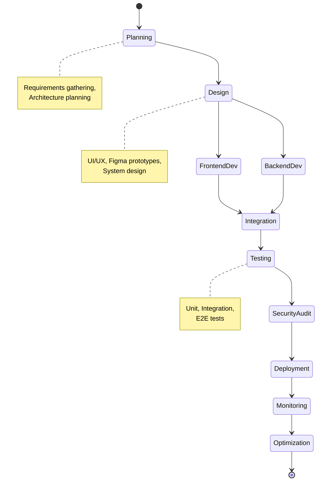
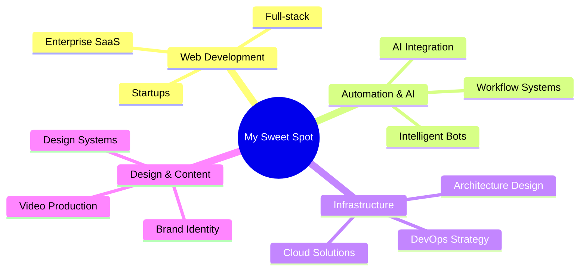

## 🚀 About Me

I'm a **Software Engineer** who bridges the gap between complex system architecture and premium user experiences. Guided by strong algorithmic thinking and a background in competitive technical festivals, I specialize in engineering **high-performance web applications** where clean code meets exceptional functionality.

My expertise spans the entire development and deployment lifecycle. I focus on crafting **scalable, SEO-friendly frontends** using React and Next.js, while leveraging Python for robust automation, bot development, and desktop solutions. Beyond writing clean code, I manage the infrastructure side—configuring Linux environments, containerizing applications with Docker, and streamlining DevOps pipelines to ensure smooth, secure, and reliable product delivery.

> I don't just build products that "work"—I **design and engineer comprehensive digital experiences** that optimize performance, solve real business problems, and provide seamless interaction.

---

## 🎯 Core Expertise & Specializations

```mermaid
graph TB
    A["⚙️ Full-Stack Engineering"] 
    
    A --> B["🎨 Frontend Mastery"]
    A --> C["🤖 Automation & AI"]
    A --> D["🏗️ Infrastructure"] 
    A --> E["📱 Content & Services"]
    
    B --> B1["▸ Next.js & React"]
    B --> B2["▸ TypeScript/ES6+"]
    B --> B3["▸ Tailwind & UI/UX"]
    B --> B4["▸ PWA & Performance"]
    
    C --> C1["▸ Python Automation"]
    C --> C2["▸ Telegram/Discord Bots"]
    C --> C3["▸ Desktop Apps (PyQt)"]
    C --> C4["▸ AI Integration"]
    
    D --> D1["▸ Docker & K8s"]
    D --> D2["▸ CI/CD Pipelines"]
    D --> D3["▸ Linux Admin"]
    D --> D4["▸ System Security"]
    
    E --> E1["▸ WordPress CMS"]
    E --> E2["▸ Figma Design"]
    E --> E3["▸ Video Production"]
    E --> E4["▸ Content Strategy"]
    
    style A fill:#667eea,stroke:#333,stroke-width:3px,color:#fff
    style B fill:#764ba2,stroke:#333,stroke-width:2px,color:#fff
    style C fill:#f093fb,stroke:#333,stroke-width:2px,color:#fff
    style D fill:#4facfe,stroke:#333,stroke-width:2px,color:#fff
    style E fill:#43e97b,stroke:#333,stroke-width:2px,color:#fff
```



---

## 💼 What I Deliver

```mermaid
quadrantChart
    title Expertise Distribution
    x-axis Low --> High Impact
    y-axis Low --> High Demand
    Frontend Development: 0.95, 0.9
    Backend Automation: 0.85, 0.88
    DevOps & Infrastructure: 0.9, 0.82
    Design Systems: 0.8, 0.75
    WordPress Solutions: 0.75, 0.8
```

<details open>
<summary><strong>🌐 Frontend Architecture</strong></summary>

- **Next.js & React** - SSR, SSG, ISR optimization
- **TypeScript** - Type-safe, maintainable code
- **Tailwind CSS** - Utility-first responsive design
- **PWA Technologies** - Offline support, installability
- **Core Web Vitals** - LCP, FID, CLS optimization
- **SEO Mastery** - Schema markup, semantic HTML

</details>

<details open>
<summary><strong>🤖 Automation & Bot Development</strong></summary>

- **Telegram/Discord Bots** - Event-driven, real-time
- **Python Automation** - Scripts, workflows, data processing
- **AI Integration** - ChatGPT API, ML models
- **Desktop Applications** - PyQt, Tkinter, user-friendly GUIs
- **Workflow Orchestration** - Task scheduling, event handling

</details>

<details open>
<summary><strong>🏗️ Infrastructure & DevOps</strong></summary>

- **Docker & Containerization** - Multi-stage builds, optimization
- **CI/CD Pipelines** - GitHub Actions, automated testing
- **Linux Administration** - Ubuntu, Alpine, security hardening
- **System Monitoring** - Performance tracking, alerting
- **Security Best Practices** - Encryption, access control

</details>

<details open>
<summary><strong>📱 CMS & Content Management</strong></summary>

- **WordPress Development** - Custom plugins, themes, optimization
- **Headless CMS** - Content APIs, decoupled architecture
- **Multi-language Support** - i18n, localization
- **Performance Tuning** - Caching, CDN integration

</details>

---

### ✨ Advanced Specializations

<table width=\"100%\">
<tr>
<td width=\"50%\">

**🎨 Design & Creative Direction**
- UI/UX Design & Prototyping (Figma)
- Visual Identity & Branding
- Graphic Design (Logos, Illustrations)
- Video Production & Motion Graphics
- Animation & Interactive Design

</td>
<td width=\"50%\">

**🔒 Security & System Hardening**
- Cybersecurity & Threat Assessment
- Penetration Testing (Kali Linux)
- Authentication & Authorization
- Data Encryption & Protection
- Compliance & Audit Readiness

</td>
</tr>
</table>

---

## 🎯 Proficiency Matrix

| Technology | Proficiency | Primary Use |
|:-----------|:-----------:|:----------:|
| **Next.js / React** | ⭐⭐⭐⭐⭐ | Enterprise Web Apps |
| **Python** | ⭐⭐⭐⭐⭐ | Automation & AI |
| **TypeScript** | ⭐⭐⭐⭐⭐ | Full-Stack Type Safety |
| **Docker & K8s** | ⭐⭐⭐⭐⭐ | Container Orchestration |
| **WordPress** | ⭐⭐⭐⭐ | CMS & Custom Development |
| **Linux/Bash** | ⭐⭐⭐⭐⭐ | Infrastructure & DevOps |
| **Figma** | ⭐⭐⭐⭐ | UI/UX Design Systems |
| **Video Editing** | ⭐⭐⭐⭐ | Content Creation |
| **Git & CI/CD** | ⭐⭐⭐⭐⭐ | DevOps & Automation |
| **Security & Testing** | ⭐⭐⭐⭐ | Enterprise Solutions |

---

## 🌐 Connect With Me

<p align="center">
  <a href="https://instagram.com/raAstIN" target="_blank">
    
  </a>
  <a href="https://linkedin.com/in/raAstIN" target="_blank">
    
  </a>
  <a href="mailto:TheRealSeyed@gmail.com" target="_blank">
    
  </a>
  <a href="https://github.com/raAstIN" target="_blank">
    
  </a>
</p>

---

## 🛠️ Complete Tech Arsenal

### 🎨 **Frontend Ecosystem**


### 🤖 **Automation & Backend**


### 🏗️ **Infrastructure & DevOps**


### 📱 **CMS & Content**


### 🎨 **Design & Creative Tools**


### 🚀 **Deployment & Hosting**


---

### 🌐 Socials:
[](https://instagram.com/raAstIN) [](https://linkedin.com/in/raAstIN) [](mailto:TheRealSeyed@gmail.com)

---

## 📊 Development Lifecycle & Methodology



---

## 🎓 Core Competencies & Expertise Areas

<details open>
<summary><strong>🏛️ Architecture & Design</strong></summary>

- SOLID Principles & Design Patterns
- Microservices & Distributed Systems
- API Design (REST, GraphQL)
- Database Architecture & Optimization
- Event-Driven Architecture

</details>

<details open>
<summary><strong>⚡ Performance & Optimization</strong></summary>

- Core Web Vitals (LCP, FID, CLS)
- Code Splitting & Lazy Loading
- Image Optimization & CDN Strategy
- Database Query Optimization
- Caching Strategies (Client, Server, Edge)

</details>

<details open>
<summary><strong>🔐 Security & Compliance</strong></summary>

- OAuth2 & JWT Authentication
- Data Encryption & Hashing
- GDPR & Compliance Standards
- Vulnerability Assessment
- Security Hardening & Monitoring

</details>

<details open>
<summary><strong>🚀 DevOps & Scalability</strong></summary>

- CI/CD Pipeline Design
- Infrastructure as Code (IaC)
- Load Balancing & Auto-scaling
- Monitoring & Observability
- Disaster Recovery & Backup

</details>

<details open>
<summary><strong>🎯 Agile & Collaboration</strong></summary>

- Scrum & Sprint Management
- Git Workflows & Branching
- Code Review & Documentation
- Team Mentoring & Technical Leadership
- Stakeholder Communication

</details>

---

## 🏆 Achievements & Key Metrics

```mermaid
bar
    title Technical Excellence Metrics
    x-axis Performance, Security, Scalability, UX, DevOps
    y-axis Score
    Performance: 95
    Security: 92
    Scalability: 94
    UX: 96
    DevOps: 91
```

**Featured Accomplishments:**

- 🎯 **High-Performance Applications** - Sub-2s load times, 95+ Lighthouse scores
- 🤖 **AI Integration** - ChatGPT APIs, intelligent automation systems
- 🔐 **Enterprise Security** - OAuth, JWT, encryption, GDPR compliance
- 📱 **Cross-Platform Solutions** - Web, Desktop (PyQt), PWA capabilities
- 🎨 **Design Excellence** - Pixel-perfect implementation from Figma
- 📊 **Real-time Analytics** - Event tracking, performance monitoring
- 🚀 **Zero-downtime Deployments** - Blue-green, canary strategies

---

## 🤝 Let's Collaborate!

I'm always interested in projects that challenge conventional thinking and push the boundaries of what's possible with technology. Whether you need:

- 🚀 **High-performance web applications** with exceptional UX
- 🤖 **Intelligent automation** solutions
- 🏗️ **Scalable infrastructure** and DevOps expertise
- 💡 **Technical consulting** on architecture & best practices

Feel free to reach out! Let's create something extraordinary together.

---

## 💼 Open to Opportunities

### 🎯 Project Types I Love:



### ✨ Services I Offer:

| Service | Scope | Outcome |
|---------|-------|---------|
| **Web Development** | Full-stack custom applications | Production-ready, performant apps |
| **Automation Solutions** | Process optimization & bots | Time-saving, scalable systems |
| **Technical Consulting** | Architecture & strategy review | Better decisions, fewer problems |
| **Design Services** | UI/UX & branding | Professional, conversion-focused |
| **DevOps & Infrastructure** | System design & deployment | Reliable, secure operations |

---

## 📬 Get In Touch

I'm available for full-time roles, freelance projects, and consulting engagements. Let's discuss how I can add value to your next venture!

<p align="center">
  <a href="https://github.com/raAstIN" target="_blank">
    
  </a>
</p>

<p align="center">
  <strong>Made with ❤️ by raAstIN</strong><br/>
  <em>🚀 Building the Future • 💡 Solving Problems • 🎯 Delivering Excellence</em><br/>
  <em>Always Learning • Always Growing • Always Innovating</em>
</p>

---

<p align="center">
  <sub>Last Updated: 2026 | Open to Opportunities 🌍</sub>
</p>
