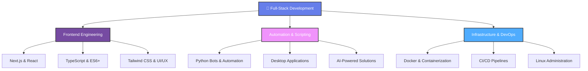

## 🚀 About Me

I'm a **Software Engineer** who bridges the gap between complex system architecture and premium user experiences. Guided by strong algorithmic thinking and a background in competitive technical festivals, I specialize in engineering **high-performance web applications** where clean code meets exceptional functionality.

My expertise spans the entire development and deployment lifecycle. I focus on crafting **scalable, SEO-friendly frontends** using React and Next.js, while leveraging Python for robust automation, bot development, and desktop solutions. Beyond writing clean code, I manage the infrastructure side—configuring Linux environments, containerizing applications with Docker, and streamlining DevOps pipelines to ensure smooth, secure, and reliable product delivery.

> I don't just build products that "work"—I **design and engineer comprehensive digital experiences** that optimize performance, solve real business problems, and provide seamless interaction.

---

## 🎯 Core Expertise & Specializations

---

## 💼 What I Do

| 🌐 **Frontend Architecture** | 🤖 **Automation & Bots** | 🏗️ **Infrastructure** |
|:-:|:-:|:-:|
| Modern responsive websites with **Next.js & React** | Smart bots for **Telegram & Discord** | **Linux** environment configuration |
| Progressive Web Apps (**PWA**) | Python-based **automation workflows** | **Docker** containerization |
| **TypeScript** for type-safe applications | AI-powered intelligent systems | **CI/CD** pipeline management |
| SEO optimization & performance tuning | Desktop apps with **PyQt/Tkinter** | System security & monitoring |

---

### ✨ Additional Capabilities

🎨 **Design & Creative**
- UI/UX Design with Figma
- Graphic Design (Logos, Banners, Visual Identity)
- Video Editing & Motion Graphics (Premiere Pro, After Effects)

🔒 **Security & Advanced Topics**
- Cybersecurity concepts & best practices
- Penetration testing (Kali Linux)
- System hardening & security audits

### 🌐 Socials:
   

# 💻 Tech Stack:
                 
